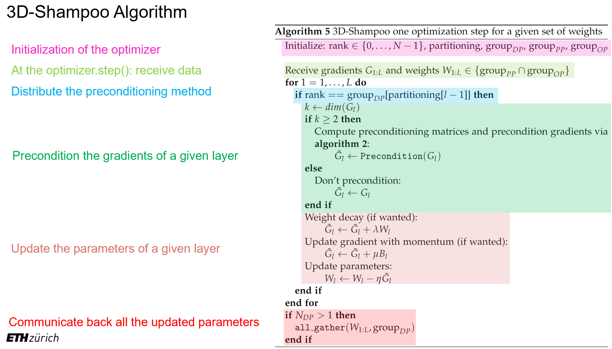

# 3D-Shampoo optimizer

3D-Shampoo is an distributed preconditioning based optimizer
to be used with the [DeepSpeed](https://github.com/microsoft/DeepSpeed) library.
Depending on the level of data parallelism of DeepSpeed, it automatically distributes the number of
preconditioning matrices across all available workers.

3D-Shampoo is a modified version of Google-Research's [Shampoo](https://github.com/noabauma/google-research/tree/master/scalable_shampoo/pytorch).

This code was created as part of my Master thesis "Distribtued Gradient Preconditioning for Training Large-Scale Models".

For more informations about 3D-Shampoo check out my Master thesis which is publicly available at the [ETH Research Collection](https://www.research-collection.ethz.ch/handle/20.500.11850/615331).

The pseudocode of 3D-Shampoo is shown below

## How to install and use

Atm, you don't have to install it, you only need to link the folders to your python script.
You can use 3D-Shampoo like every other type of PyTorch based optimizers. 
3D-Shampoo will work if initialized with DeepSpeed, otherwise it is just basic Shampoo from Google-Research.

"""
# loading shampoo optimizer
import sys
sys.path.append('../3d-shampoo/src/')
import shampoo

...

optimizer = shampoo.Shampoo(params=model.parameters(),
                            world_rank=world_rank,
                            world_size=world_size,
                            topology=model.topology(), 
                            shapes=[tuple(p.shape) for p in model.parameters() if p.requires_grad], 
                            lr=1e-1, 
                            momentum=0.9, 
                            hyperparams=shampoo.ShampooHyperParams(ignore_embedding_layer=True))
    
optimizer = shampoo.Shampoo(params=model.parameters(), 
                            topology=model.topology(), 
                            shapes=[tuple(p.shape) for p in model.parameters() if p.requires_grad], 
                            lr=1e-1, 
                            momentum=0.9, 
                            hyperparams=shampoo.ShampooHyperParams())
							
model_engine, optimizer, _, _ = deepspeed.initialize(args=cmd_args,
                                                         model=model,
                                                         optimizer=optimizer
                                                        )
"""

