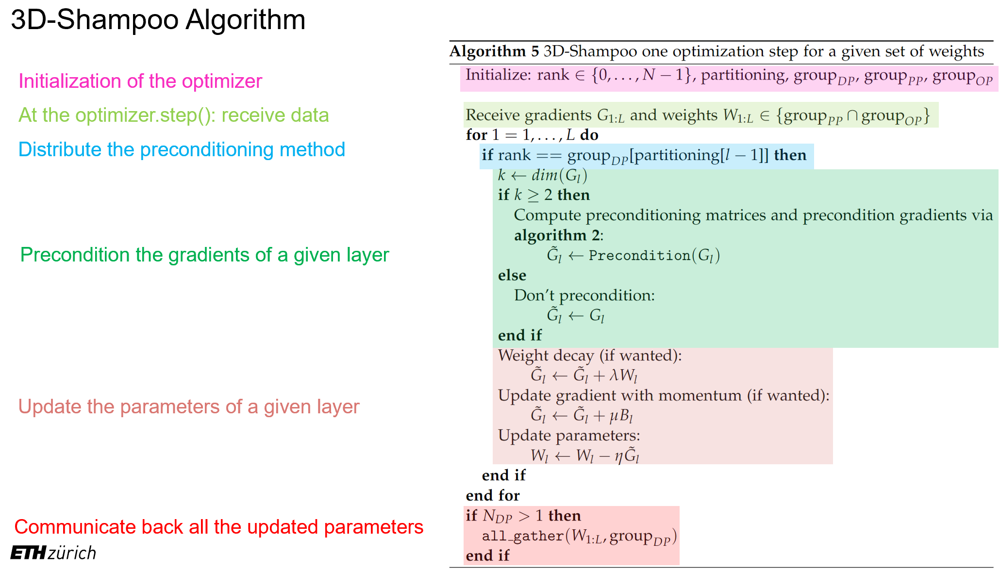
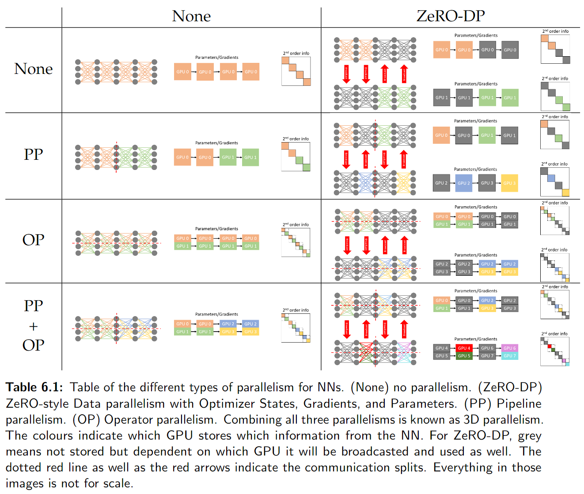

# 3D-Shampoo optimizer

3D-Shampoo is a distributed preconditioning-based optimizer to be used with the
[DeepSpeed](https://github.com/microsoft/DeepSpeed) library. Depending on the level of data
parallelism of DeepSpeed, it automatically distributes the computation of the preconditioning
matrices across all available workers.

3D-Shampoo is a modified version of Google-Research's
[Shampoo](https://github.com/google-research/google-research/tree/master/scalable_shampoo/pytorch).

This code was created as part of my Master thesis *"Distributed Gradient Preconditioning for
Training Large-Scale Models"*, which is publicly available at the
[ETH Research Collection](https://www.research-collection.ethz.ch/handle/20.500.11850/615331)
and contains all the details about the algorithm.

The pseudocode of 3D-Shampoo is shown below:



3D-Shampoo distributes the preconditioning matrices according to the level of parallelism
that is active in DeepSpeed:



If there are more layers to precondition than available workers, the layers are distributed
according to a cost function that balances the preconditioning workload as evenly as possible.
If there are more workers than layers, the extra workers idle during preconditioning.

**NOTE:** ZeRO optimization is not supported (stage 0 only), because ZeRO does not store the
preconditioning matrices.

## Installation

There is no package to install; you only add the `src/` folder to your Python path
(see the usage example below). The dependencies are:

```bash
pip install -r requirements.txt
```

`torch` and `numpy` are enough for the plain (single-process) optimizer; `deepspeed` is needed
for the distributed features and the examples. Last tested with Python 3.12, torch 2.13,
DeepSpeed 0.19.

## How to use

3D-Shampoo is used like every other PyTorch optimizer. It distributes the preconditioning work
if it is given a DeepSpeed topology; without one (`topology=None`) it is just basic Shampoo
from Google-Research.

```python
import torch
import deepspeed

# loading the 3d-shampoo optimizer
import sys
sys.path.append('path/to/3d-shampoo/src')
import shampoo_3d

# initialize torch.distributed *before* creating the optimizer,
# it has to create communicator groups along the data-parallel axis
deepspeed.init_distributed()

# define the model, e.g. as a deepspeed.pipe.PipelineModule
model = ...

optimizer = shampoo_3d.Shampoo_3D(params=model.parameters(),
                                  world_rank=torch.distributed.get_rank(),
                                  world_size=torch.distributed.get_world_size(),
                                  topology=model.topology(),  # the DeepSpeed process topology
                                  lr=1e-1,
                                  momentum=0.9)

model_engine, optimizer, _, _ = deepspeed.initialize(args=cmd_args,
                                                     model=model,
                                                     optimizer=optimizer)

# train your model
...
```

A `PipelineModule` provides the topology via `model.topology()`. For pure data parallelism
(no pipeline) build the topology yourself:

```python
from deepspeed.runtime.pipe.topology import PipeDataParallelTopology
topology = PipeDataParallelTopology(num_pp=1, num_dp=world_size)
```

Complete runnable scripts for both cases are in
[`examples/simple_deepspeed_examples`](examples/simple_deepspeed_examples).

### Hyperparameters

All Shampoo-specific options are collected in the `ShampooHyperParams` dataclass, e.g.:

```python
hps = shampoo_3d.ShampooHyperParams(block_size=128,           # split big layers into blocks
                                    graft_type=shampoo_3d.LayerwiseGrafting.SGD,
                                    preconditioning_compute_steps=1,
                                    weight_decay=0.0)
optimizer = shampoo_3d.Shampoo_3D(..., hyperparams=hps)
```

The most important ones:

| option | meaning |
|---|---|
| `block_size` | split dimensions larger than this into blocks (0 = never split) |
| `best_effort_shape_interpretation` | merge small dimensions, e.g. a `[512, 5, 5, 64]` conv becomes `[512, 25, 64]` |
| `statistics_compute_steps` / `preconditioning_compute_steps` | how often statistics / preconditioners are recomputed |
| `graft_type` | layerwise grafting onto SGD (default), Adagrad or none |
| `num_iter`, `fix_iter` | iteration count of the inverse-pth-root solver; `fix_iter` keeps the work identical on all ranks |
| `named_modules` | optional list of `(name, module)` per parameter; parameters of modules whose name contains `"embed"` are not preconditioned |

To skip embedding layers, pass `named_modules` with one entry per parameter:

```python
named_modules = []
for name, module in model.named_modules():
    if hasattr(module, 'weight'):
        named_modules.append((name, module))
    if hasattr(module, 'bias') and module.bias is not None:
        named_modules.append((name, module))

hps = shampoo_3d.ShampooHyperParams(named_modules=named_modules)
```

## Tests

`tests/test_shampoo_3d.py` checks the matrix root computation against a direct
eigendecomposition, trains small models on CPU/GPU, and verifies that distributed runs
(2 and 3 data-parallel ranks, gloo backend, no GPUs needed) stay identical across ranks and
match a single-process reference:

```bash
python tests/test_shampoo_3d.py
```
